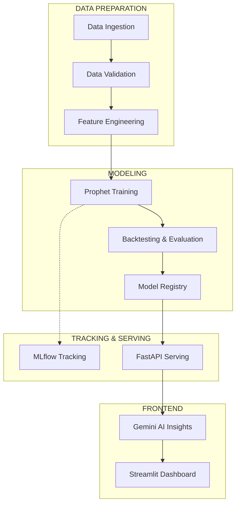

# 📈 TubePulse: Enterprise YouTube Growth Intelligence

TubePulse is a professional-grade ML intelligence platform designed to forecast YouTube channel growth and provide AI-driven strategic insights. By combining **Facebook Prophet** for time-series forecasting, **MLflow** for experiment tracking, and **Google Gemini Pro** for strategic analysis, TubePulse transforms raw data into actionable creator intelligence.

---

## 🚀 Key Features

*   **Enterprise ML Pipeline**: Automated end-to-end workflow from data ingestion to model serving.
*   **High-Precision Forecasting**: 30 to 365-day projections for Subscribers and Views using Prophet.
*   **Automated Backtesting**: Real-time accuracy metrics (MAE/MAPE) calculated via historical validation.
*   **MLflow Integration**: Full experiment tracking and model registry for reproducibility.
*   **AI Strategic Insights**: Generative AI analysis (Gemini Pro Pro) providing actionable growth tips based on performance data.
*   **Premium Dashboard**: High-fidelity Streamlit UI with executive summary cards and interactive Plotly visualizations.

---

## 🛠️ Tech Stack

*   **Backend**: FastAPI, Python
*   **Modeling**: Facebook Prophet, Scikit-learn
*   **Experiment Tracking**: MLflow
*   **AI Engine**: Google Generative AI (Gemini Pro Pro)
*   **Frontend**: Streamlit, Plotly
*   **DevOps**: Docker (Optional), Git

---

## 🏗️ Architecture



---

## 🛠️ Installation & Setup

1. **Clone the repository**:
   ```bash
   git clone https://github.com/SunilKundruk/Youtube_Intelligence.git
   cd Youtube_Intelligence
   ```

2. **Install dependencies**:
   ```bash
   pip install -r requirements.txt
   ```

3. **Set up environment variables**:
   Create a `.env` file in the root directory and add:
   ```env
   GEMINI_API_KEY=your_api_key_here
   FASTAPI_URL=http://localhost:8000
   ```

4. **Run the Backend (API)**:
   ```bash
   uvicorn src.api:app --reload
   ```

5. **Launch the Dashboard**:
   ```bash
   streamlit run app.py
   ```

---

## 📈 Dashboard Preview
*The dashboard features a signature blush-red UI, real-time metrics, and AI-powered recommendations.*

---

## 📄 License
This project is licensed under the MIT License.
